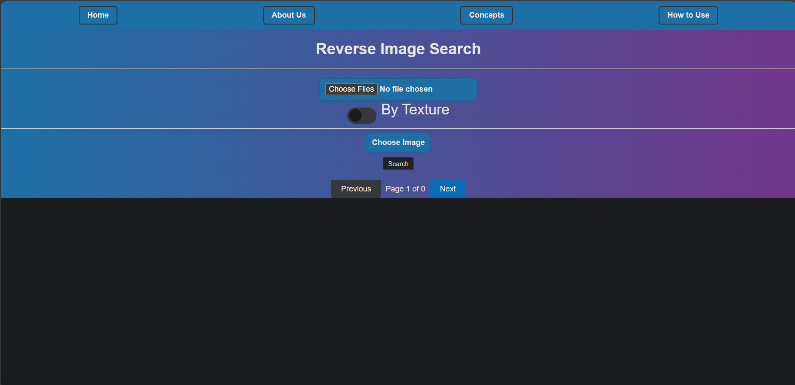

# Tubes2
> Tubes 2 Algeo untuk kelompok Linier bukan Linear

## Table of Contents
* [General Info](#general-information)
* [Technologies Used](#technologies-used)
* [Features](#features)
* [Screenshots](#screenshots)
* [Setup](#setup)
* [Usage](#usage)
* [Project Status](#project-status)
* [Room for Improvement](#room-for-improvement)
* [Credits](#credits)

## General Information
Website sistem temu balik gambar dengan memanfaatkan CBIR dengan parameter warna dan tekstur. Menampilkan tingkat kemiripannya satu gambar dengan gambar lain. Dapat menerima satu gambar maupun satu dataset. Dibuat dalam rangka Tugas Besar 2 Aljabar Linear dan Geometri.

## Technologies Used
- Python 3.0
- npm
- Flask
- React

## Features
Komparasi gambar dengan dataset berdasarkan: 
- Parameter warna
- Parameter tekstur

## Screenshots

<!-- If you have screenshots you'd like to share, include them here. -->

## Setup
What are the project requirements/dependencies? Where are they listed? A requirements.txt or a Pipfile.lock file perhaps? Where is it located?

Proceed to describe how to install / setup one's local environment / get started with the project.

## Usage
1. Tekan 'Choose Files' untuk mengunggah dataset
2. Tekan 'Choose Image' untuk mengunggah _reference image_
3. Atur 'Toggle' untuk memilih antara komparasi gambar dengan parameter warna atau komparasi gambar dengan tekstur
4. Tekan 'Search'
5. Website akan menampilkan semua gambar beserta persentase kemiripannya

## Project Status
Project is: _in progress_ 

## Room for Improvement
- Implementasi parallel processing sehingga banyak foto dapat diproses sekaligus
- Meningkatkan akurasi komparasi gambar dengan parameter tekstur

## Credits
Created by :
1. Ariel Herfrison (13522002)
2. Bastian H.S. (13522034)
3. Venantius Sean Ardi Nugroho (13522078)
